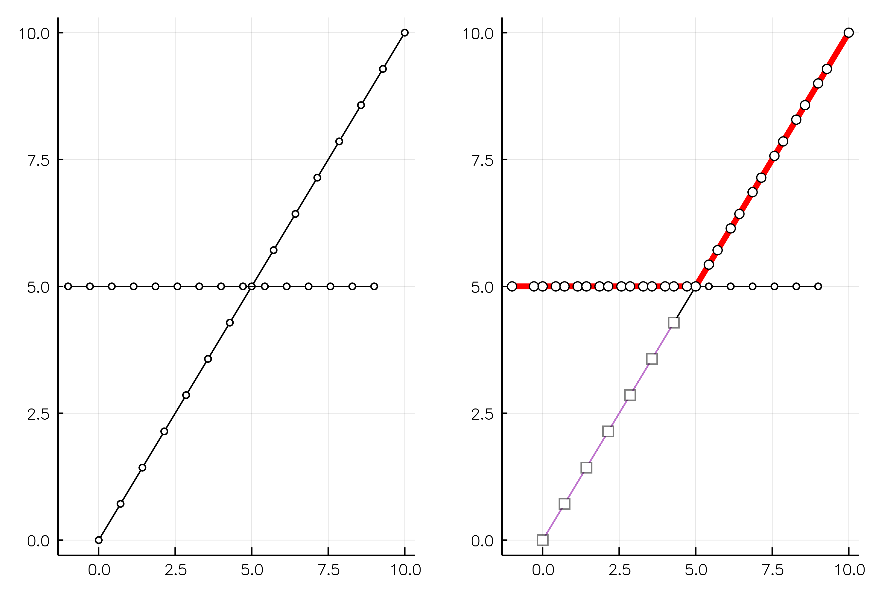
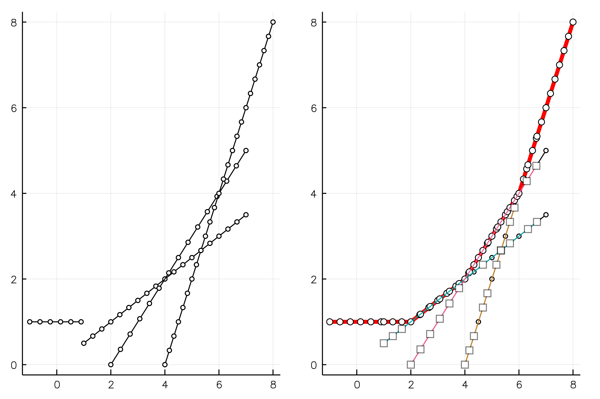
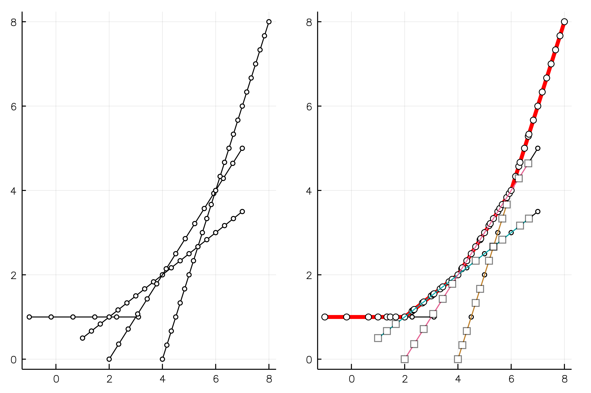
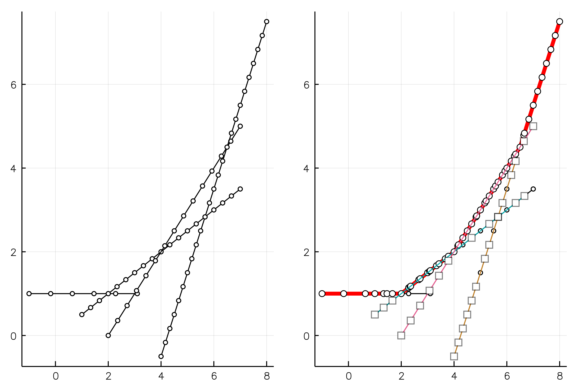
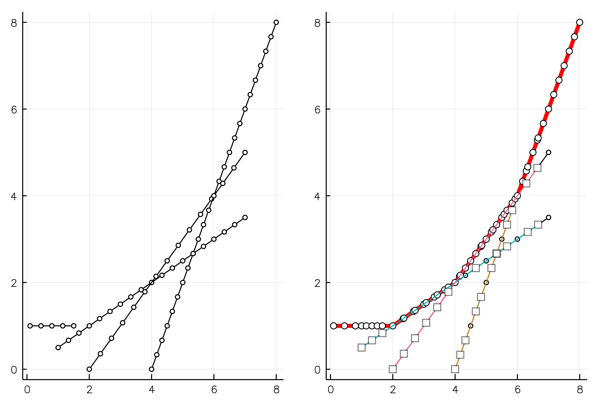

# MultiLine

This is a julia implementation of [Fedor's `polyline` class in matlab](https://github.com/floswald/dcegm).

This is a component package for the DCEGM algorithm.

### What it does

#### case 1

#### case 2a

#### case 2b

#### case 2c

#### case 3

